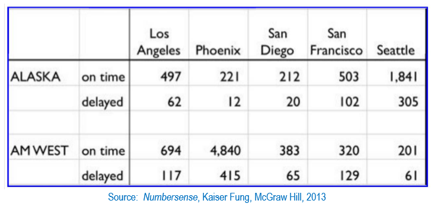

```{r setup, include=FALSE}
knitr::opts_chunk$set(echo = TRUE)
```

# Goal-Setting
The stated goal in this assignment is to take source data from a CSV file, as seen below, and transform it into a tidy form ready for analysis. In particular, we need to be able to compare delay times for both airlines listed.




# Loading
Our first step is to load the data, which I do using `readr::read_csv` and we immediately get a warning message about the two unnamed columns thanks to the particular aesthetic/formatting of the source file. 

```{r, eval=TRUE, message=FALSE}
library(dplyr)
library(tidyr)
data_url <- "https://raw.githubusercontent.com/mijomu/DATA-607/master/HW5/data.csv"
(flights <- readr::read_csv(data_url))
```

# Tidying

## Transforming the data
In order to facilitate any downstream analysis, we need to first tidy the data. Below is how I went about tidying this particular data set, though I am sure there are plenty of alternatives. I store the pipeline as a function for later assignment.

```{r, eval=TRUE}
tidy_flights <- function(df) {
  df %>% 
  filter(!is.na(X2)) %>% 
  fill(X1, .direction = "down") %>% 
  rename("airline" = "X1", "status" = "X2") %>% 
  pivot_longer(cols = c(-airline, -status),
               names_to = "destination", values_to = "arrivals")
}

```

I'll walk through my process in the subsequent chunks, detailing each step blow by blow.

### Filtering unnecessary rows

Having loaded the data into a tibble/dataframe, I pipe this to the `filter` function to exclude rows with a NA value in `X2`. Given the original format of the data, this means we are removing the blank line that separates the two tables representing each airline's arrivals data. When piping, it is much more readable to keep each "movement" on its own line(s) so that the procedure flows logically top to bottom, left to right.

```{r, eval=TRUE}
flights %>% 
  filter(!is.na(X2))
```

### Filling missing values

Now that we have that gone, we want to finish filling out the values for `X1` and do so by piping the filtered results to the `fill` function. Specificying "down" for the `.direction` argument, this fills any missing value with whatever value is above it. Hence, filling down.

```{r, eval=TRUE}
flights %>% 
  filter(!is.na(X2)) %>% 
  fill(X1, .direction = "down")
```

### Naming unnamed columns

From here, piping to the `rename` function, the two initial columns (`X1` and `X2`) are renamed to `airline` and `status`.

```{r, eval=TRUE}
flights %>% 
  filter(!is.na(X2)) %>% 
  fill(X1, .direction = "down") %>% 
  rename("airline" = "X1", "status" = "X2")
```

### Restructuring arrival columns

Finally, the results are piped to the `pivot_longer` function. Here we ignore the `airline` and `status` columns and focus on the rest. Each
remaining column is named for a destination and contains a numeric value describing the number of arrivals. To make this tidy, we need to ensure that
each column represents only one variable and in this case we can transform this into a single variable named `destination` and another named `arrivals`,
each of which describes exactly those distinct elements.

```{r, eval=TRUE}
flights %>% 
  filter(!is.na(X2)) %>% 
  fill(X1, .direction = "down") %>% 
  rename("airline" = "X1", "status" = "X2") %>% 
  pivot_longer(cols = c(-airline, -status), names_to = "destination", values_to = "arrivals")
```

Now that we've walked through the process, I call the `tidy_flights` function to actually run the process detailed above and tidy the data.

```{r, echo=FALSE, eval=TRUE}
flights <- tidy_flights(flights)
```

## Analyzing the flights data

Now that the data is in a tidy format, we can readily do grouped aggregates and start to get a sense of how airline arrivals compare. Using the combination of `group_by` and one of the `summarize` series of functions, we can quickly see the total flights by status for each airline. We can see Alaska has 286 fewer delays, however, they have `6438+787 - 501+3274` fewer flights overall than AM West. As a whole, AM West may be overrepresented in the data such that any conclusions drawn would not be definitive. 

```{r, eval=TRUE}
(grouped_flights <- flights %>%
  group_by(airline, status) %>% 
  summarize_at("arrivals", sum))
```

While we know there is a difference of a few hundred delays across airlines, we have also seen that they both deal with a very different load of flights overall - AM West recording nearly twice as many arrivals as Alaska. Visualizing the proportion of arrivals these delays make up for each airline should help us have a better understanding of the performance of each airline. Knowing the data to be non-granular, I set up a function to easily create bar charts through ggplot2. Because it bothers me aesthetically, I also employed a quick `mutate` and `stringr::str_to_title` to make the `status` string values look better as legend labels.

```{r, eval=TRUE}
library(ggplot2)

quick_col <- function(df, x, y, fill = "gray", pos = "stack",
                      label_vars = NA) {
  col_plot <- ggplot(df, aes_string(x, y, fill = fill)) + geom_col(position = pos)
  
  if (is.character(label_vars)){
    col_plot <- col_plot +
      labs(title = label_vars["title"],
           x = label_vars["x"], y = label_vars["y"],
           fill = label_vars["legend"])
  }
  
  return(col_plot)
}


flights <- mutate_at(flights, "status", stringr::str_to_title)
quick_col(flights, "airline", "arrivals", fill = "status", pos = "fill",
          label_vars = c("title" = "Flight Delays by Airline",
                         "x" = "Airline",
                         "y" = "Proportion of Arrivals",
                         "legend" = "Flight Status"))
  
```

The visualization showed us a negligible difference in performance, as measured by the proportion of delays versus on time arrivals. We can see hard numbers below and note that Alaska recorded about 13.2% of their arrivals as delayed versus AM West's 10.8% - a difference of about 2.4%. without industry-specific knowledge, we know there is a difference but the magnitude or significance is debatable.

```{r, eval=TRUE}
airline_names <- c("ALASKA", "AM WEST")
airline_totals <- purrr::map_dbl(airline_names, ~ sum(filter(flights, airline == .x)$arrivals)) %>%
  setNames(airline_names)
 
grouped_flights %>% mutate(proportion = arrivals / airline_totals[airline])
```

Having seen the airlines themselves do not display a marked difference in delays, destination may have an impact. Visualized below, we see that San Francisco has a greater proportion of delayed flights than the other locations listed. Phoenix, on the other hand, records the lowest proportion of delays.

```{r, eval=TRUE}
quick_col(flights, "destination", "arrivals", fill = "status", pos = "fill",
          label_vars = c("title" = "Flight Status by Destination",
                         "x" = "City of Arrival",
                         "y" = "Proportion of Arrivals",
                         "legend" = "Flight Status"))
```

Grouping the arrival figures by destination, we see that Phoenix is clearly the most serviced location when we aggregate total arrivals by location. This destination experiences both the lowest proportion of delays and the greatest number of arrivals within the scope of our two airlines. In fact, when added together, all the other destinations' arrivals only exceed Phoenix's number of arrivals by 24.

```{r, eval=TRUE}
flights %>%
  group_by(destination) %>%
  summarize_at("arrivals", sum)
```

Below we can see the make-up of each city's arrivals by airline. We can now see that the vast majority of AM West's arrivals are landing in Phoenix, whereas Alaska's most served destination is Seattle. That said, Alaska's arrivals are proportionally more spread out than those of AM West.

```{r, eval=TRUE}
quick_col(flights, "destination", "arrivals", fill = "airline", pos = "dodge",
          label_vars = c("title" = "Airlines by Destination",
                         "x" = "City of Arrival",
                         "y" = "Number of Arrivals",
                         "legend" = "Airline"))
```

# Conclusion

We have observed a disproportionate number of flights landing in Phoenix under the AM West banner. While this may represent the typical course of business for these airlines, it is difficult to draw definitive conclusions given what we have recorded as a result of this imbalance. At this juncture, we might be able to postulate that AM West has refined its operations such that they have become extremely efficient in clearing their flights for landing in Phoenix, but there are a number of factors that could impact what we have observed that we do not have recorded. For example, we have no context for atmospheric conditions or whether the flights themselves were direct or connecting routes.

Given more features, perhaps additional data sets (for atmospheric conditions/weather, for example) and more time, we may derive more conclusive observations in how these airlines perform.
